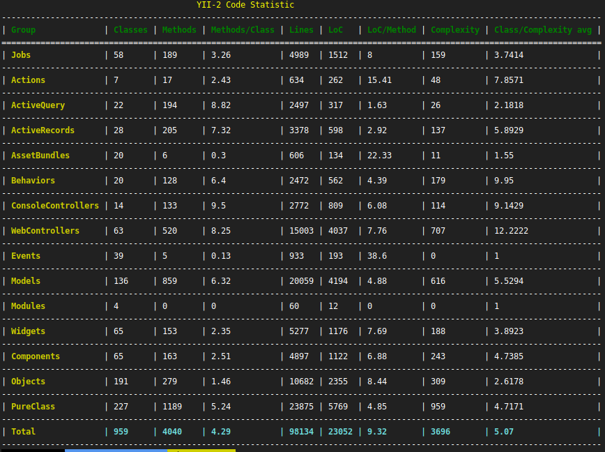

Yii2 Code Statistic
===================
[](https://travis-ci.org/Insolita/yii2-codestat)
[](https://scrutinizer-ci.com/g/Insolita/yii2-codestat/?branch=master)
[](https://insight.sensiolabs.com/projects/a2b84a39-bbae-4330-ae75-d464111f98ac)



Based on phploc/phploc

Installation
============

Either run

```
composer require --dev insolita/yii2-codestat:~2.0
```
or add

```
"insolita/yii2-codestat": "~2.0"
```
in require-dev section of your `composer.json` file.

Basic Usage
-----------

Add in console configuration file, in section modules

```
php
'modules'=>[
 ....
        'codestat'=>[
            'class'=>\insolita\codestat\CodeStatModule::class,
            'scanTargets' => ['@backend/','@common/','@frontend/','@console/'],
            'exceptTargets' => ['*config*','vendor*','*web/','*runtime/','*views/','*tests/'],
        ]
    ],

```

 **scanTargets**   - array of path, or path aliases that will be scanned recursively
 **exceptTargets** - array of path patterns for excluding

For checking whole list of files that will be processed, run
```
./yii codestat/default/list-files
```

For statistic summary output run
```
./yii codestat
```

For statistic summary output with show bad resolved files
```
./yii codestat 1
```

Show full phploc report per each defined group

```
./yii codestat/default/advanced 
./yii codestat/default/advanced WebControllers
```

Show full phploc report for all matched files

```
./yii codestat/default/common
```

Show full phploc report for custom directory

```
./yii codestat/default/directory @common/models
```

Show full phploc report for custom file

```
./yii codestat/default/file @common/lib/MySuperClass.php
```

List available metrics with codes
```
./yii codestat/default/list-metrics
```

Advanced Usage
--------------

#### Custom Class Grouping Rules

You can extend or overwrite property 'groupRules', with supported formats

`'Group Name' => 'BaseParentClass'`

 where 'BaseParentClass' should by verified with `(\ReflectionClass)->isSubclassOf()`
 
or

```
'Group Name' => function(\ReflectionClass $reflection){
       //Should return true if class valid for this group, otherwise false;
  }
```

Final example

```
php
'modules'=>[
 ....
        'codestat'=>[
            'class'=>\insolita\codestat\CodeStatModule::class,
             'groupRules' => [
                                'Jobs' => 'yii\queue\JobInterface',
                                'Handlers' => 'trntv\bus\interfaces\Handler::class',
                                'DTO' => function (\ReflectionClass $reflection) {
                                     return mb_strpos($reflection->getFileName(), 'Dto')!==false;
                                },
                                'All Tests' => function (\ReflectionClass $reflection) {
                                    return $reflection->isSubclassOf('\Codeception\Test\Unit')
                                        || StringHelper::endsWith($reflection->getName(), 'Cest');
                                },
                            ] + CodeStatModule::defaultRules(),
                    ],
        ]
    ],
```
**Important!** The order of the rules in the list matters, the base classes (\yii\base\Component and \yii\base\Object) should be at the end of the list!

### Custom code metrics

Code metrics provided by [https://github.com/sebastianbergmann/phploc](https://github.com/sebastianbergmann/phploc),  has lot of variants, you can define own combination

For actions advanced/common/directory/file you should set metrics property with array of necessary metric names

```
php
'modules'=>[
 ....
        'codestat'=>[
            'class'=>\insolita\codestat\CodeStatModule::class,
            'metrics'=>['loc','lloc','classCcnAvg', 'classLlocAvg', 'methodCcnAvg']
            ]
 ]
```

For summary action you should provide property 'analyseCallback' in module like as
```php
    'analyseCallback = function($group){
               /**@var insolita\codestat\lib\collection\Group $group **/
               $metrics=$customAnalyzer->analyze($group->getFiles());
               return ['totalFiles'=>count($group->getFiles()),  'metric1'=>$metrics[some], ...etc];
     }
```
It should return associative array with `'metric name' => 'metric value'` data and will replace internal https://github
.com/Insolita/yii2-codestat/blob/7d0fc3351718b2052624ea091ff8f154fe471aeb/src/lib/CodestatService.php#L154

And also table summary convention - if metric name contains slash "/", for summary row will be counted average value, otherwise sum


